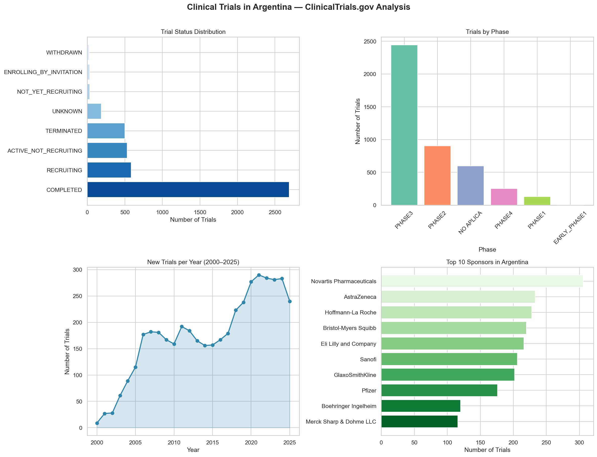
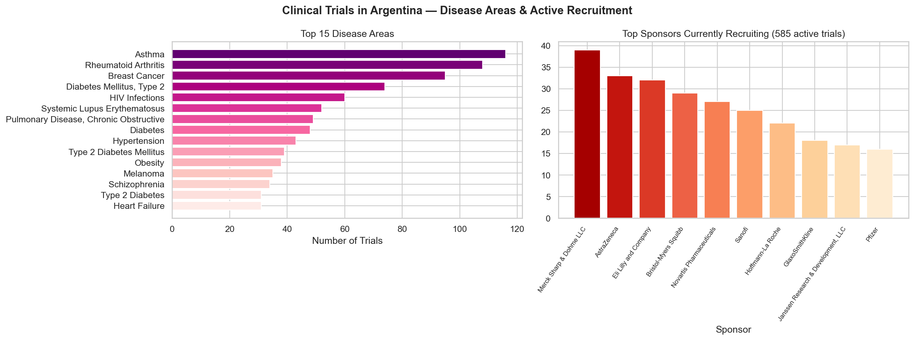

# 🏥 Clinical Trials in Argentina — ClinicalTrials.gov Analysis

## Overview
Exploratory data analysis of **4,596 clinical trials** registered in Argentina 
on ClinicalTrials.gov, using the public API v2.

## Key Findings
- **585 trials currently recruiting** patients in Argentina
- **Phase III dominates** — Argentina is a key destination for late-stage research
- **Novartis, AstraZeneca and Roche** are the most active sponsors historically
- **Asthma and Rheumatoid Arthritis** are the leading disease areas
- Clear **peak in 2020–2022** driven by COVID-19 trials

## Visualizations

## Tools
- Python 3.13
- pandas, matplotlib, seaborn, requests
- Data source: [ClinicalTrials.gov API v2](https://clinicaltrials.gov/data-api/api)

## Author
María Paula Vera Morandini — Biochemist | Clinical Research & Health Data Analyst  
[LinkedIn](https://www.linkedin.com/in/maria-paula-vera-morandini-43b284399/) | 
[Portfolio](https://mariapaulaveram.github.io/portfolio/)