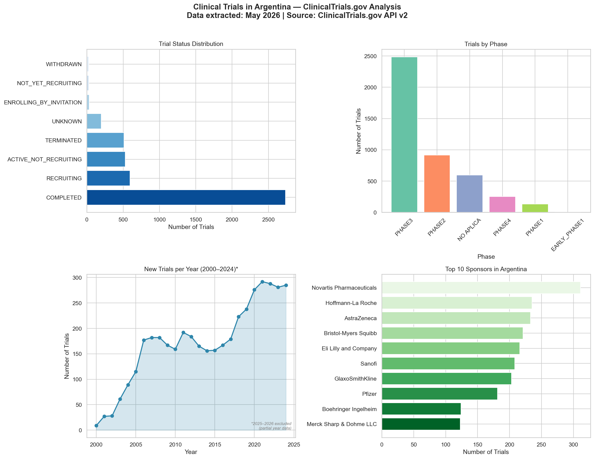
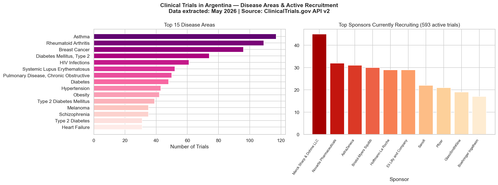

# 🏥 Clinical Trials in Argentina — ClinicalTrials.gov Analysis

## Overview
Exploratory data analysis of clinical trials registered in Argentina on ClinicalTrials.gov, using the public API v2.

> **Data extracted: May 2026**

## Key Findings
- **Phase III dominates** — Argentina is a key destination for late-stage research
- **Novartis, AstraZeneca and Roche** are the most active sponsors historically
- **Asthma and Rheumatoid Arthritis** are the leading disease areas
- Clear **peak in 2020–2022** driven by COVID-19 trials

## Visualizations

### Overview — Status, Phases, Trends & Top Sponsors

### Disease Areas & Active Recruitment

## Tools
- Python 3.13
- pandas, matplotlib, seaborn, requests
- Data source: [ClinicalTrials.gov API v2](https://clinicaltrials.gov/data-api/api)

## Methodology Notes
- Trials were retrieved using `query.locn: "Argentina"` — this captures studies listing Argentina as a location, but may include trials where Argentina is mentioned without being an active recruitment site.
- The year trend chart covers **2000–2024 only**. Data from 2025–2026 was excluded to avoid partial-year bias, as trials initiated in those years are still being registered.
- For disease area analysis, only the **primary condition** listed per trial was used. Many trials list multiple conditions; a full multi-condition breakdown would require exploding the conditions column.
- For phase analysis, only the **primary phase** was used. Some trials span two phases (e.g., PHASE2/PHASE3); full phase data is available in the `todas_fases` column of the dataset.

## Limitations
This is an **exploratory descriptive analysis** — causal factors were intentionally out of scope.

Specific limitations to consider:

1. **Geographic filter precision**: `query.locn: "Argentina"` may return trials where Argentina appears in free-text fields, not necessarily as an active site. A stricter filter using `query.locn` combined with country-level fields could improve precision.

2. **Single condition per trial**: Only the first listed condition was used for disease area ranking. Trials with multiple conditions are partially underrepresented in some areas.

3. **No population normalization**: Trial counts were not adjusted for population size or GDP. Argentina's apparent dominance in certain areas may partially reflect its large urban population rather than research infrastructure alone.

4. **Sponsor name inconsistencies**: The same sponsor may appear under slightly different names (e.g., "Novartis" vs. "Novartis Pharmaceuticals"). No name normalization was applied; counts may be slightly underestimated for some sponsors.

5. **Snapshot in time**: ClinicalTrials.gov data changes continuously. Figures reflect the state of the registry at the time of extraction (May 2026) and will differ from past or future snapshots.

6. **Interventional vs. observational**: The dataset includes all study types. Filtering to interventional trials only would give a more focused view of drug/device development activity.

## Author
María Paula Vera Morandini — Biochemist | Clinical Research & Health Data Analyst  
[LinkedIn](https://www.linkedin.com/in/maria-paula-vera-morandini-43b284399/) | [Portfolio](https://mariapaulaveram.github.io/portfolio/)
